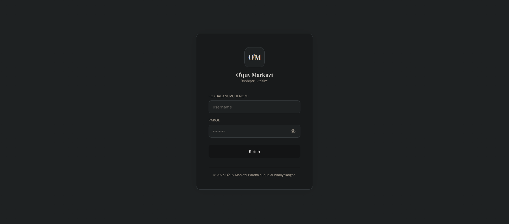
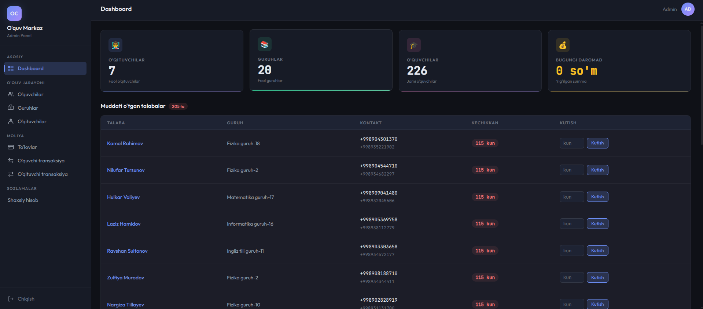
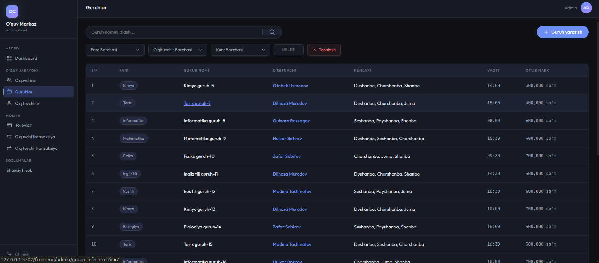

# 🎓 O'quv Markazi ERP

O'quv markazlari faoliyatini boshqarish uchun ishlab chiqilgan **ERP (Enterprise Resource Planning)** tizimi.

Loyiha o'quv markazidagi kundalik jarayonlarni — **o'quvchilar, guruhlar, o'qituvchilar, to'lovlar, davomat va moliyaviy hisob-kitoblarni** — markazlashtirilgan tizim orqali boshqarish va imkon qadar avtomatlashtirish uchun yaratilgan.

> 🚧 Loyiha ishlab chiqish jarayonida. Funksiyalar va arxitektura keyinchalik kengaytirilishi mumkin.

---

## ✨ Asosiy imkoniyatlar

- 🔐 Foydalanuvchilar uchun autentifikatsiya va login tizimi
- 👥 Rollarga asoslangan kirish nazorati
- 🧑‍💼 **Admin**, **Superadmin** va **Teacher** rollari
- 👨‍🎓 O'quvchilarni boshqarish
- 👨‍🏫 O'qituvchilarni boshqarish
- 📚 Guruhlarni yaratish va boshqarish
- 💰 O'quvchi to'lovlari va moliyaviy tranzaksiyalarni boshqarish
- 📊 O'quv markazi bo'yicha asosiy statistikalarni dashboard orqali ko'rish
- 📅 Guruhlarning dars kunlari va vaqtlarini boshqarish
- 💵 Oylik to'lovlar va moliyaviy ma'lumotlarni yuritish
- 📱 O'quvchilar bilan bog'liq kontakt ma'lumotlarini saqlash
- 🔎 Guruhlar va ma'lumotlar bo'yicha qidirish va filtrlash
- 📖 FastAPI asosidagi REST API
- 📑 Swagger UI va ReDoc orqali API hujjatlari

---

## 👤 Foydalanuvchi rollari

Tizimda 3 xil asosiy rol mavjud:

| Rol                      | Vazifasi                                                                  |
| ------------------------ | ------------------------------------------------------------------------- |
| 🛡️**Superadmin** | Tizim va o'quv markazi ustidan yuqori darajadagi boshqaruv                |
| 👨‍💼**Admin**    | O'quvchilar, guruhlar, o'qituvchilar va moliyaviy jarayonlarni boshqarish |
| 👨‍🏫**Teacher**  | O'qituvchiga tegishli o'quv jarayonlarini boshqarish                      |

---

## 🛠️ Texnologiyalar

### Backend

- 🐍 **Python**
- ⚡ **FastAPI**
- 🗃️ **SQLAlchemy 2**
- 🐘 **PostgreSQL**
- 🔄 **asyncpg**
- 📦 **Pydantic**
- 🔑 **JWT**
- 🔐 **Argon2**
- 🚀 **Uvicorn**

### Frontend

- 🌐 **HTML5**
- 🎨 **CSS3**
- ⚙️ **JavaScript**
- 🖥️ **VS Code Live Server**

### Qo'shimcha kutubxonalar

Loyihaning barcha Python dependency'lari `requirements.txt` faylida ko'rsatilgan.

---

## 📁 Loyiha strukturasi

```text
erp/
├── app/
│   ├── api/
│   ├── core/
│   ├── db/
│   ├── models/
│   ├── schemas/
│   ├── services/
│   ├── utils/
│   ├── depends.py
│   └── main.py
│
├── frontend/
│   ├── admin/
│   ├── superadmin/
│   ├── teacher/
│   └── index.html
│
├── .env.sample
├── .gitignore
├── requirements.txt
├── seed.sql
└── README.md
```

---

# 🚀 O'rnatish

Loyihani lokal kompyuterda ishga tushirish uchun quyidagi qadamlarni bajaring.

## 1. Repository'ni clone qilish

```bash
git clone https://github.com/Laz1zbekDev/erp.git
cd erp
```

---

# 🐧 Linux

## 2. Virtual environment yaratish

```bash
python3 -m venv .venv
```

## 3. Virtual environment'ni faollashtirish

```bash
source .venv/bin/activate
```

Faollashgandan keyin terminal boshida odatda quyidagiga o'xshash yozuv paydo bo'ladi:

```text
(.venv)
```

## 4. Dependency'larni o'rnatish

```bash
pip install -r requirements.txt
```

## 5. `.env` faylini yaratish

```bash
cp .env.sample .env
```

Keyin `.env` faylini ochib, kerakli qiymatlarni kiriting.

## 6. Backend'ni ishga tushirish

```bash
uvicorn app.main:app --reload
```

Backend odatda quyidagi manzilda ishlaydi:

```text
http://127.0.0.1:8000
```

---

# 🍎 macOS

## 2. Virtual environment yaratish

```bash
python3 -m venv .venv
```

## 3. Virtual environment'ni faollashtirish

```bash
source .venv/bin/activate
```

## 4. Dependency'larni o'rnatish

```bash
pip install -r requirements.txt
```

## 5. `.env` faylini yaratish

```bash
cp .env.sample .env
```

`.env` faylini ochib, PostgreSQL, JWT va boshqa kerakli sozlamalarni kiriting.

## 6. Backend'ni ishga tushirish

```bash
uvicorn app.main:app --reload
```

Backend:

```text
http://127.0.0.1:8000
```

---

# 🪟 Windows

### PowerShell

## 2. Virtual environment yaratish

```powershell
py -m venv .venv
```

## 3. Virtual environment'ni faollashtirish

```powershell
.\.venv\Scripts\Activate.ps1
```

Agar PowerShell execution policy bilan bog'liq xatolik chiqarsa, terminal konfiguratsiyasiga mos ravishda Python virtual environment'ni faollashtirish kerak bo'ladi.

## 4. Dependency'larni o'rnatish

```powershell
pip install -r requirements.txt
```

## 5. `.env` faylini yaratish

PowerShell:

```powershell
Copy-Item .env.sample .env
```

Yoki `.env.sample` faylidan nusxa olib, nomini `.env` ga o'zgartiring.

## 6. Backend'ni ishga tushirish

```powershell
uvicorn app.main:app --reload
```

Backend:

```text
http://127.0.0.1:8000
```

### Windows CMD

Virtual environment:

```cmd
py -m venv .venv
.venv\Scripts\activate
```

Dependency:

```cmd
pip install -r requirements.txt
```

`.env`:

```cmd
copy .env.sample .env
```

Backend:

```cmd
uvicorn app.main:app --reload
```

---

# ⚙️ `.env` konfiguratsiyasi

Loyihani ishga tushirishdan oldin `.env.sample` faylidan `.env` yarating:

```text
.env.sample → .env
```

`.env` ichida quyidagi konfiguratsiyalar mavjud:

```env
# Server configuration
SERVER_HOST=
SERVER_PORT=

# Database
DB_HOST=
DB_PORT=
DB_USER=
DB_PASS=
DB_NAME=

# JWT
JWT_SECRET_KEY_ACCESS=
JWT_SECRET_KEY_REFRESH=
JWT_ALGORITHM=
JWT_ACCESS_TOKEN_EXPIRE_MINUTES=
JWT_REFRESH_TOKEN_EXPIRE_DAYS=

# SMS / notification service
EMAIL=
PASSWORD=
FROM_NAME=
CALLBACK_URL=

# Superadmin
SUPERADMIN_PASSWORD=
SUPERADMIN_FIRST_NAME=
SUPERADMIN_LAST_NAME=
```

### Muhim

⚠️ `.env` faylingizdagi **parol, JWT secret key, database credentials va boshqa maxfiy ma'lumotlarni GitHub'ga yuklamang**.

Repository'da `.env.sample` mavjud bo'lib, u kerakli environment variable nomlarini ko'rsatish uchun ishlatiladi.

---

# 🗄️ PostgreSQL

Loyiha PostgreSQL ma'lumotlar bazasidan foydalanadi.

`.env` faylida PostgreSQL ma'lumotlarini ko'rsating:

```env
DB_HOST=localhost
DB_PORT=5432
DB_USER=your_user
DB_PASS=your_password
DB_NAME=your_database
```

> `DB_HOST`, `DB_PORT`, `DB_USER`, `DB_PASS` va `DB_NAME` qiymatlarini o'zingizning PostgreSQL konfiguratsiyangizga moslang.

---

# ▶️ Frontend'ni ishga tushirish

Backend va frontend alohida ishga tushiriladi.

Backend:

```bash
uvicorn app.main:app --reload
```

Frontend uchun `frontend/index.html` faylini **VS Code Live Server** orqali ishga tushiring.

### VS Code

1. VS Code'da loyihani oching.
2. `frontend/index.html` faylini oching.
3. **Live Server** extension o'rnatilgan bo'lsa, pastki o'ng tomondagi **Go Live** tugmasini bosing.
4. Frontend brauzerda ochiladi.

> Frontend backend API'ga murojaat qilishi uchun backend server ham bir vaqtning o'zida ishlab turgan bo'lishi kerak.

---

# 📚 API Documentation

FastAPI avtomatik ravishda API hujjatlarini yaratadi.

Backend ishga tushirilgandan so'ng:

### Swagger UI

```text
http://127.0.0.1:8000/docs
```

### ReDoc

```text
http://127.0.0.1:8000/redoc
```

Swagger orqali API endpoint'larini ko'rish va test qilish mumkin.

---

# 🖼️ Loyihadan lavhalar

## 🔐 Login



## 📊 Dashboard



## 👥 Guruhlar



---

# 🔒 Xavfsizlik

Loyihada autentifikatsiya va xavfsizlik uchun quyidagi texnologiyalardan foydalanilgan:

- 🔑 JWT access/refresh token
- 🔐 Argon2 password hashing
- 🛡️ Role-based access control
- ⚙️ Environment variables orqali maxfiy konfiguratsiyalarni boshqarish

Maxfiy ma'lumotlarni `.env` orqali saqlash va `.gitignore` yordamida repository'dan tashqarida qoldirish tavsiya etiladi.

---

# 🧩 Dependency'lar

Asosiy Python dependency'lari:

```text
FastAPI
SQLAlchemy
asyncpg
Pydantic
pydantic-settings
python-jose
passlib
argon2-cffi
python-multipart
python-dotenv
Uvicorn
httpx
requests
```

Barcha aniq versiyalar `requirements.txt` faylida mavjud.

---

# 📌 Kelajakdagi rivojlantirish

Loyiha kelajakda quyidagi yo'nalishlarda kengaytirilishi mumkin:

- 📈 Kengaytirilgan moliyaviy hisobotlar
- 📊 Qo'shimcha statistika va analitika
- 📱 Mobil ilova
- 🔔 SMS va notification tizimini kengaytirish
- 📅 Davomat tizimini yanada rivojlantirish
- 💳 To'lov tizimlari bilan integratsiya
- 🧾 Hisobotlarni PDF/Excel ko'rinishida eksport qilish

---

# 👨‍💻 Muallif

**Laziz**

GitHub: [@Laz1zbekDev](https://github.com/Laz1zbekDev)

Repository: [O&#39;quv Markazi ERP](https://github.com/Laz1zbekDev/erp)

---

## ⭐ Agar loyiha foydali bo'lsa

Repository'ga ⭐ **Star** bosib qo'yishingiz mumkin.
